# P9ML Membrane Computing System - Technical Architecture

> **Comprehensive Technical Architecture for P9ML Membrane Computing Integration with Neural Networks**

## Table of Contents
- [System Overview](#system-overview)
- [Architectural Principles](#architectural-principles)
- [Component Deep Dive](#component-deep-dive)
- [Data Flow Architecture](#data-flow-architecture)
- [Cognitive Grammar System](#cognitive-grammar-system)
- [Evolution and Adaptation](#evolution-and-adaptation)
- [Integration Patterns](#integration-patterns)
- [Performance Architecture](#performance-architecture)
- [API Architecture](#api-architecture)

---

## System Overview

The P9ML Membrane Computing System represents a paradigmatic shift from traditional neural networks to **cognitive computing architectures**. It integrates membrane computing principles with neural networks to create adaptive, self-modifying computational systems.

### High-Level Architecture

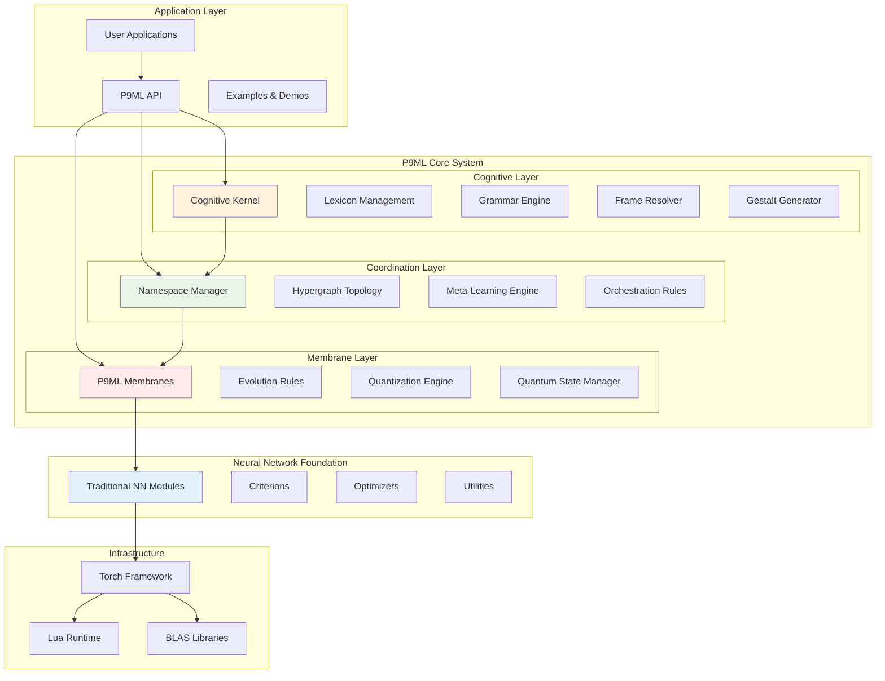

---

## Architectural Principles

### 1. Membrane Computing Paradigm

The system follows **P-system computational model** where:
- **Membranes** encapsulate neural layers with evolutionary capabilities
- **Objects** represent tensor data and gradients
- **Rules** define evolution and transformation operations
- **Hierarchies** enable nested computational structures

### 2. Cognitive Grammar Foundation

Neural computation is modeled as **grammatical transformations**:
- **Lexemes**: Tensor shapes as vocabulary elements
- **Grammar Rules**: Neural transformations as production systems
- **Meta-Grammar**: Namespace coordination as higher-order rules
- **Semantics**: Cognitive meaning through gestalt fields

### 3. Adaptive Evolution

Systems exhibit **self-modifying behavior** through:
- **Evolution Rules**: Dynamic parameter adaptation
- **Meta-Learning**: Recursive improvement of learning strategies
- **Quantization Adaptation**: Precision optimization during training
- **Topology Evolution**: Dynamic graph structure modification

---

## Component Deep Dive

### P9MLMembrane Architecture

```mermaid
classDiagram
    class P9MLMembrane {
        +membrane_id: string
        +tensor_vocabulary: table
        +membrane_objects: table
        +evolution_rules: table
        +qat_state: table
        +quantum_state: table
        
        +__init(module, membrane_id)
        +addEvolutionRule(rule)
        +enableQuantization(bits, scale)
        +updateOutput(input)
        +updateGradInput(input, gradOutput)
        +getMembraneInfo()
        +_evolveMembraneState()
        +_applyMembraneTransformation(output)
    }
    
    class MembraneObject {
        +tensor: Tensor
        +gradient: Tensor
        +membrane_id: string
        +evolution_state: string
        +quantum_state: table
    }
    
    class QuantumState {
        +superposition: Tensor
        +entanglement_map: table
        +coherence_factor: number
    }
    
    P9MLMembrane ||--o{ MembraneObject
    MembraneObject ||--|| QuantumState
```

#### Key Features:
- **Tensor Vocabulary**: Automatic shape analysis and complexity calculation
- **Evolution Integration**: Dynamic rule application during forward/backward passes
- **Quantum Inspiration**: Superposition states for enhanced memory
- **QAT Support**: Adaptive precision with minimal accuracy loss

### P9MLNamespace Architecture  

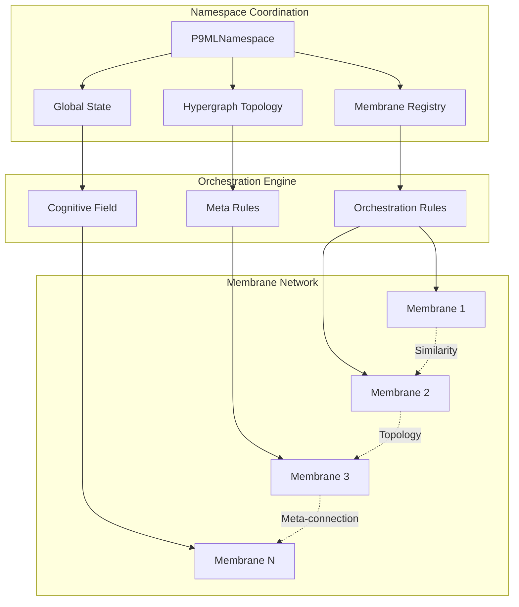

#### Coordination Mechanisms:
- **Cognitive Signatures**: Unique fingerprints for membrane identification
- **Similarity Mapping**: Automatic relationship discovery
- **Meta-Learning**: Recursive adaptation of coordination strategies
- **Distributed State**: Global coordination without centralized bottlenecks

### P9MLCognitiveKernel Architecture

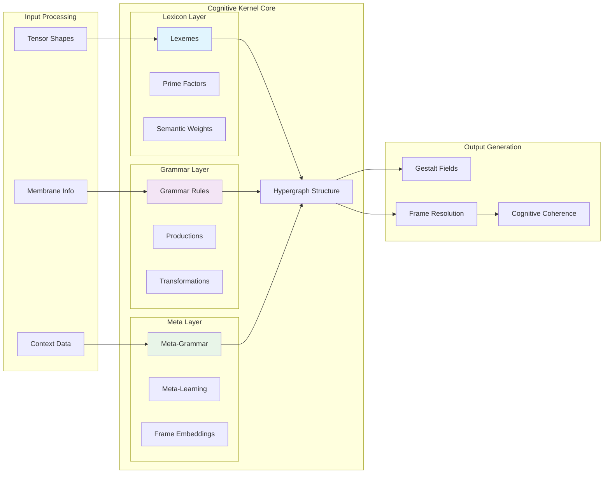

#### Cognitive Operations:
- **Lexeme Management**: Prime factorization of tensor shapes
- **Grammar Production**: Membrane transformations as linguistic rules
- **Frame Problem Resolution**: Nested context embeddings
- **Gestalt Generation**: Unified tensor field synthesis

---

## Data Flow Architecture

### Standard Neural Network Flow vs P9ML Enhanced Flow

```mermaid
graph TD
    subgraph "Traditional Flow"
        I1[Input] --> L1[Linear] --> A1[Activation] --> L2[Linear] --> O1[Output]
    end
    
    subgraph "P9ML Enhanced Flow"
        I2[Input] --> M1[Membrane 1]
        M1 --> E1[Evolution]
        E1 --> Q1[Quantization]
        Q1 --> T1[Transform]
        T1 --> A2[Activation]
        A2 --> M2[Membrane 2]
        M2 --> E2[Evolution]
        E2 --> Q2[Quantization]
        Q2 --> T2[Transform]
        T2 --> NS[Namespace Sync]
        NS --> CK[Cognitive Update]
        CK --> GF[Gestalt Field]
        GF --> O2[Enhanced Output]
    end
    
    style M1 fill:#ffebee
    style M2 fill:#ffebee
    style CK fill:#fff3e0
    style GF fill:#e8f5e8
```

### Cognitive Data Transformation Pipeline

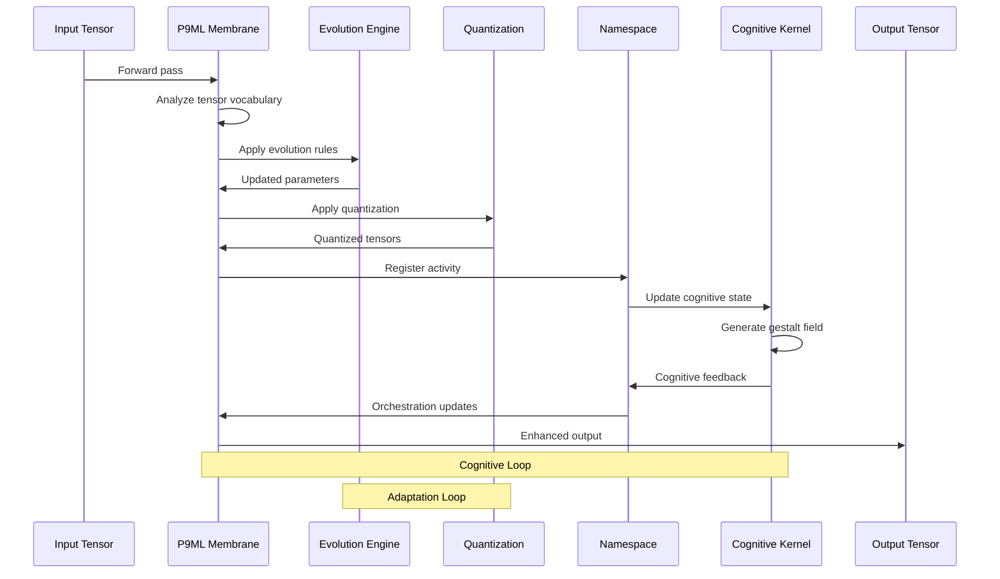

---

## Cognitive Grammar System

### Lexeme-Grammar-Meta Architecture

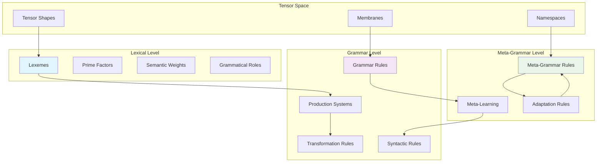

### Prime Factor Tensor Decomposition

Tensor shapes are decomposed into prime factors for cognitive representation:

```
Tensor Shape: [128, 64, 32] 
Prime Factorization: [2^7, 2^6, 2^5]
Cognitive Signature: {base: 2, powers: [7, 6, 5], complexity: 18}
Grammatical Role: "feature_transformer" (based on dimensionality pattern)
```

### Frame Problem Resolution Architecture

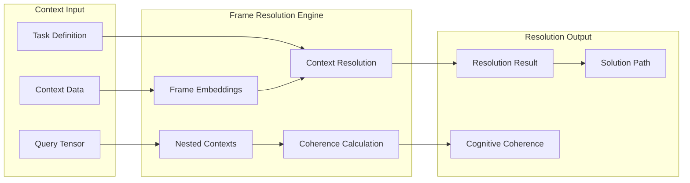

---

## Evolution and Adaptation

### Evolution Rule System

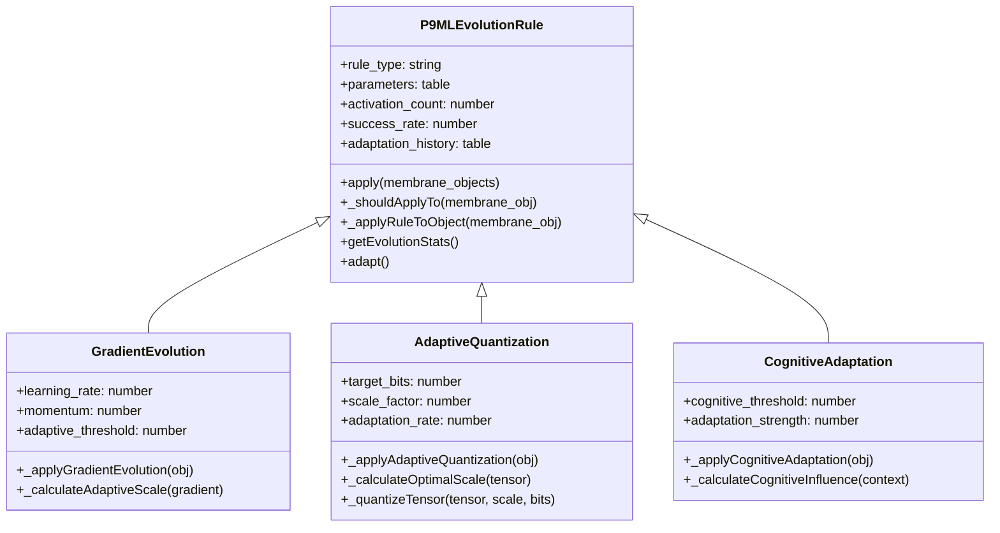

### Meta-Learning Architecture

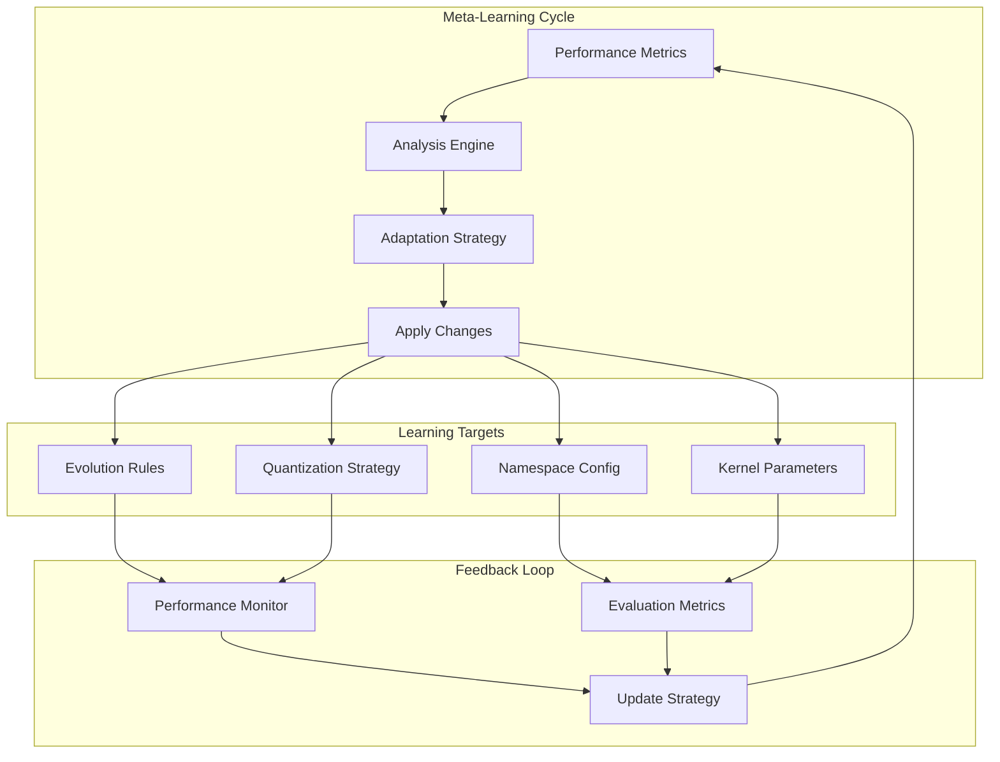

---

## Integration Patterns

### Membrane Wrapping Pattern

```lua
-- Pattern 1: Direct Wrapping
local membrane = nn.P9MLMembrane(nn.Linear(784, 128), 'feature_extractor')

-- Pattern 2: Enhanced Wrapping with Evolution
local membrane = nn.P9MLMembrane(nn.Linear(784, 128), 'feature_extractor')
membrane:addEvolutionRule(nn.P9MLEvolutionFactory.createGradientEvolution(0.01, 0.9))
membrane:enableQuantization(8, 0.1)

-- Pattern 3: Cognitive Integration
local namespace = nn.P9MLNamespace('mnist_system')
local kernel = nn.P9MLCognitiveKernel()

local membrane = nn.P9MLMembrane(nn.Linear(784, 128), 'feature_extractor')
namespace:registerMembrane(membrane)
kernel:addLexeme({784, 128}, 'feature_extractor')
kernel:addGrammarRule(membrane:getMembraneInfo())
```

### Network Construction Patterns

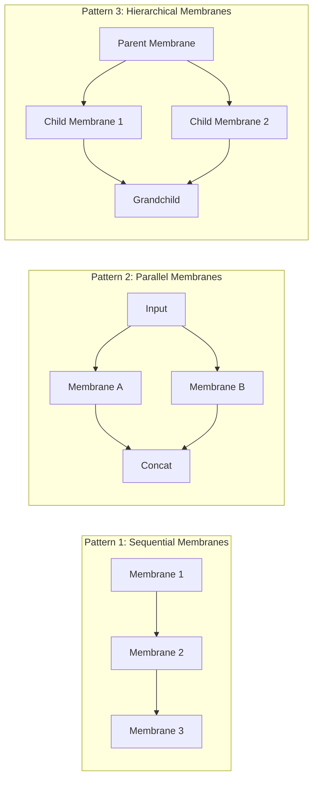

---

## Performance Architecture

### Computational Complexity

| Operation | Traditional NN | P9ML Enhanced | Overhead |
|-----------|---------------|---------------|----------|
| Forward Pass | O(n) | O(n + k) | +k evolution |
| Backward Pass | O(n) | O(n + k) | +k evolution |
| Memory | O(m) | O(m + c) | +c cognitive |
| Quantization | N/A | O(q) | +q adaptive |

Where:
- n = standard neural computation
- k = evolution rule complexity  
- m = standard memory usage
- c = cognitive state size
- q = quantization operations

### Memory Architecture

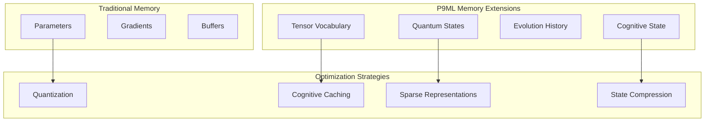

### Parallel Processing Architecture

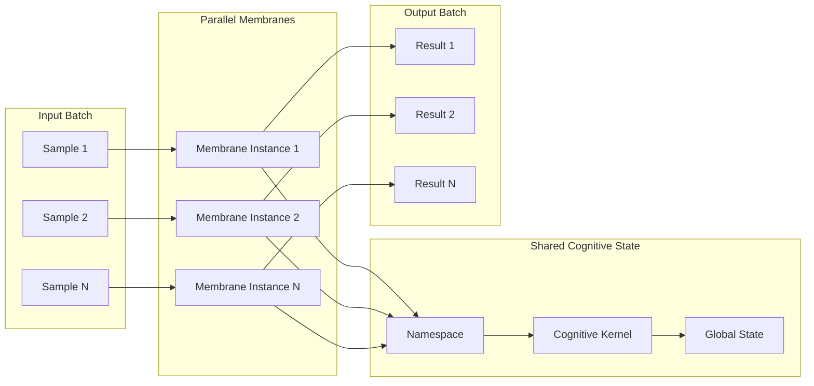

---

## API Architecture

### Core API Structure

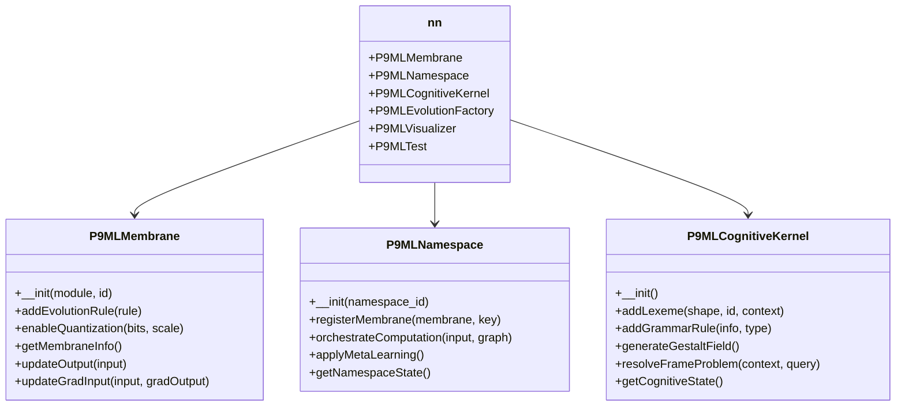

### Evolution Factory Pattern

```lua
-- Factory pattern for evolution rules
local factory = nn.P9MLEvolutionFactory

-- Gradient-based evolution
local grad_rule = factory.createGradientEvolution({
    learning_rate = 0.01,
    momentum = 0.9,
    adaptive_threshold = 0.001
})

-- Adaptive quantization  
local quant_rule = factory.createAdaptiveQuantization({
    target_bits = 8,
    scale_factor = 0.1,
    adaptation_rate = 0.01
})

-- Cognitive adaptation
local cog_rule = factory.createCognitiveAdaptation({
    cognitive_threshold = 0.5,
    adaptation_strength = 0.1
})
```

---

## Conclusion

The P9ML Membrane Computing System represents a fundamental advancement in neural network architecture, providing:

1. **Cognitive Computing Capabilities**: Through grammatical representation of neural computation
2. **Adaptive Evolution**: Self-modifying networks that improve during training
3. **Distributed Coordination**: Namespace management for complex neural hierarchies  
4. **Quantum-Inspired Memory**: Enhanced state representation and storage
5. **Frame Problem Resolution**: Contextual understanding and reasoning capabilities

This architecture enables the creation of neural networks that are not just computational graphs, but **cognitive computing systems** capable of adaptation, reasoning, and self-improvement.

---

### Next Steps

- [📖 Read Integration Guide](doc/p9ml_integration.md)
- [🧪 Try Examples](examples/p9ml_example.lua)
- [🔧 Explore API Reference](doc/api_reference.md)
- [🏠 Return to README](README.md)