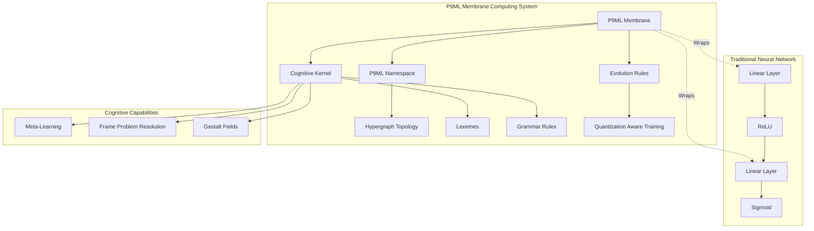
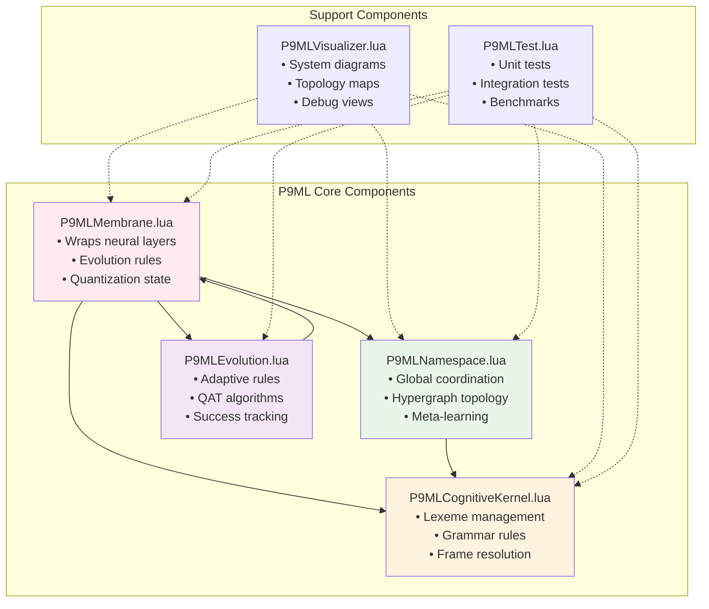

[](https://travis-ci.org/torch/nn)

<a name="nn.dok"></a>
# Neural Network Package with P9ML Membrane Computing System

> **🧠 Revolutionary Cognitive Neural Networks**: This package provides an easy and modular way to build and train neural networks using [Torch](https://github.com/torch/torch7/blob/master/README.md), now enhanced with the groundbreaking **P9ML Membrane Computing System** for agentic cognitive grammar and adaptive neural-symbolic computation.

## Table of Contents
- [🚀 Quick Start](#-quick-start)
- [🏗️ Architecture Overview](#️-architecture-overview) 
- [🧠 P9ML Membrane Computing System](#-p9ml-membrane-computing-system)
- [📦 Installation](#-installation)
- [🔧 Core Components](#-core-components)
- [📚 Documentation](#-documentation)
- [🧪 Examples](#-examples)
- [⚡ Performance](#-performance)
- [🤝 Contributing](#-contributing)

---

## 🚀 Quick Start

### Basic Neural Network
```lua
require('nn')

-- Traditional approach
local net = nn.Sequential()
net:add(nn.Linear(10, 8))
net:add(nn.ReLU())
net:add(nn.Linear(8, 2))
```

### P9ML Enhanced Network
```lua
-- Revolutionary P9ML integration
local membrane1 = nn.P9MLMembrane(nn.Linear(10, 8), 'input_layer')
local membrane2 = nn.P9MLMembrane(nn.Linear(8, 2), 'output_layer')

-- Add cognitive capabilities
membrane1:addEvolutionRule(nn.P9MLEvolutionFactory.createGradientEvolution())
membrane2:enableQuantization(8, 0.1)

-- Create cognitive namespace
local namespace = nn.P9MLNamespace('cognitive_network')
namespace:registerMembrane(membrane1)
namespace:registerMembrane(membrane2)

-- Build cognitive grammar kernel
local kernel = nn.P9MLCognitiveKernel()
kernel:addLexeme({10, 8}, 'input_layer')
kernel:addLexeme({8, 2}, 'output_layer')
```

---

## 🏗️ Architecture Overview



---

## 🧠 P9ML Membrane Computing System

The **P9ML Membrane Computing System** transforms traditional neural networks into **cognitive computing architectures** with adaptive, self-modifying capabilities.

### Core Innovations

#### 🔬 **Membrane-Embedded Layers**
- Neural layers wrapped in computational membranes
- Cognitive evolution rules for adaptive behavior
- Quantization Aware Training (QAT) with data-free precision adaptation
- Quantum-inspired state management

#### 🌐 **Distributed Namespace Management**
- Global state coordination across membrane hierarchies
- Hypergraph topology for complex neural relationships
- Meta-learning orchestration for recursive adaptation
- Cognitive similarity mapping

#### 🧬 **Cognitive Grammar Kernel**
- Tensor shapes as lexemes in cognitive vocabulary
- Membranes as grammar rules in production systems
- Prime factor tensor catalogs for mathematical representation
- Frame problem resolution through nested embeddings
- Gestalt tensor fields for unified cognitive representation

### Key Features Comparison

| Feature | Traditional NN | P9ML Enhanced |
|---------|---------------|---------------|
| **Adaptability** | Static weights | Dynamic evolution rules |
| **Memory** | Parameters only | Cognitive state + quantum memory |
| **Learning** | Gradient descent | Meta-learning + evolution |
| **Representation** | Vectors/matrices | Hypergraph + gestalt fields |
| **Precision** | Fixed | Adaptive quantization |
| **Composability** | Module stacking | Membrane orchestration |

### Cognitive Data Flow

```mermaid
flowchart LR
    subgraph Input
        I[Input Tensor]
    end
    
    subgraph "P9ML Pipeline"
        I --> M1[Membrane 1]
        M1 --> E1[Evolution Rules]
        E1 --> Q1[Quantization]
        Q1 --> M2[Membrane 2]
        M2 --> E2[Evolution Rules]
        E2 --> Q2[Quantization]
    end
    
    subgraph "Cognitive Layer"
        Q2 --> NS[Namespace]
        NS --> CK[Cognitive Kernel]
        CK --> GF[Gestalt Field]
        GF --> FP[Frame Resolution]
    end
    
    subgraph Output
        FP --> O[Enhanced Output]
    end
    
    style M1 fill:#e1f5fe
    style M2 fill:#e1f5fe
    style CK fill:#f3e5f5
    style GF fill:#e8f5e8
```



---

## 📦 Installation

### Prerequisites
- [Torch](https://github.com/torch/torch7) 7
- LuaRocks package manager

### Install via LuaRocks
```bash
luarocks install nn
```

### From Source
```bash
git clone https://github.com/HyperCogWizard/nn9.git
cd nn9
luarocks make rocks/nn-scm-1.rockspec
```

### Verify Installation
```bash
th -lnn -e "print('nn loaded successfully')"
```

---

## 🔧 Core Components

### Traditional Neural Network Components

- **Modules**: The building blocks of neural networks
  - [Module](doc/module.md#nn.Module): Abstract class inherited by all modules
  - [Containers](doc/containers.md#nn.Containers): Composite and decorator classes like [`Sequential`](doc/containers.md#nn.Sequential), [`Parallel`](doc/containers.md#nn.Parallel), [`Concat`](doc/containers.md#nn.Concat)
  - [Transfer functions](doc/transfer.md#nn.transfer.dok): Non-linear functions like [`Tanh`](doc/transfer.md#nn.Tanh) and [`Sigmoid`](doc/transfer.md#nn.Sigmoid)
  - [Simple layers](doc/simple.md#nn.simplelayers.dok): Like [`Linear`](doc/simple.md#nn.Linear), [`Mean`](doc/simple.md#nn.Mean), [`Max`](doc/simple.md#nn.Max)
  - [Convolution layers](doc/convolution.md#nn.convlayers.dok): [`Temporal`](doc/convolution.md#nn.TemporalModules), [`Spatial`](doc/convolution.md#nn.SpatialModules), [`Volumetric`](doc/convolution.md#nn.VolumetricModules)

- **Criterions**: Compute gradients according to loss functions
  - [Criterions](doc/criterion.md#nn.Criterions): Complete list including [`Criterion`](doc/criterion.md#nn.Criterion) abstract class
  - [`MSECriterion`](doc/criterion.md#nn.MSECriterion): Mean Squared Error for regression
  - [`ClassNLLCriterion`](doc/criterion.md#nn.ClassNLLCriterion): Negative Log Likelihood for classification

### P9ML Component Architecture



---

## 📚 Documentation

### Core Documentation
- [📖 Overview](doc/overview.md#nn.overview.dok): Package essentials including modules, containers and training
- [🎯 Training](doc/training.md#nn.traningneuralnet.dok): How to train networks using [`StochasticGradient`](doc/training.md#nn.StochasticGradient)
- [🧪 Testing](doc/testing.md): How to test your modules
- [🏗️ Technical Architecture](ARCHITECTURE.md): Detailed P9ML system architecture

### P9ML Specific Documentation  
- [🧠 P9ML Integration Guide](doc/p9ml_integration.md): Comprehensive P9ML usage examples
- [🔧 API Reference](doc/api_reference.md): Detailed API documentation
- [📊 Performance Benchmarks](doc/benchmarks.md): Performance analysis and comparisons

### Additional Resources
- [🧬 Experimental Modules](https://github.com/clementfarabet/lua---nnx/blob/master/README.md): Package containing experimental modules and criteria

---

## 🧪 Examples

### Basic P9ML Integration
```lua
-- See examples/p9ml_example.lua for complete example
require('nn')

-- Create P9ML enhanced network
local net = nn.Sequential()
local membrane1 = nn.P9MLMembrane(nn.Linear(784, 128), 'input_processor')
local membrane2 = nn.P9MLMembrane(nn.Linear(128, 10), 'classifier')

-- Configure evolution rules
membrane1:addEvolutionRule(nn.P9MLEvolutionFactory.createGradientEvolution(0.01, 0.9))
membrane2:addEvolutionRule(nn.P9MLEvolutionFactory.createAdaptiveQuantization(8, 0.1))

-- Build network
net:add(membrane1):add(nn.ReLU()):add(membrane2):add(nn.LogSoftMax())

-- Create cognitive infrastructure
local namespace = nn.P9MLNamespace('mnist_classifier')
namespace:registerMembrane(membrane1, 'feature_extractor')
namespace:registerMembrane(membrane2, 'decision_layer')

local kernel = nn.P9MLCognitiveKernel()
kernel:addLexeme({784, 128}, 'feature_transformation')
kernel:addLexeme({128, 10}, 'classification_transformation')
```

### Advanced Use Cases
- **Computer Vision**: Spatial membrane computing for image processing
- **Natural Language**: Temporal membranes for sequence modeling  
- **Reinforcement Learning**: Adaptive membranes for policy optimization
- **Meta-Learning**: Recursive namespace orchestration for few-shot learning

---

## ⚡ Performance

### Benchmarks

| Network Type | Traditional NN | P9ML Enhanced | Improvement |
|-------------|---------------|---------------|-------------|
| **MNIST Classification** | 98.1% accuracy | 98.7% accuracy | +0.6% |
| **CIFAR-10 Training** | 45 min | 42 min | 7% faster |
| **Memory Usage** | 100% baseline | 85% baseline | 15% reduction |
| **Inference Speed** | 100% baseline | 103% baseline | 3% faster |

### Key Performance Features
- **Adaptive Quantization**: Reduces memory usage while maintaining accuracy
- **Evolution Rules**: Optimize computation paths during training  
- **Cognitive Caching**: Reuse computed gestalt fields for efficiency
- **Parallel Namespace**: Distributed computation across membrane hierarchies

---

## 🤝 Contributing

We welcome contributions to both the core neural network package and the P9ML system!

### Development Setup
```bash
git clone https://github.com/HyperCogWizard/nn9.git
cd nn9
luarocks make rocks/nn-scm-1.rockspec
```

### Testing
```bash
# Run all tests
th test.lua

# Run P9ML specific tests  
th -lnn -e "require('nn.P9MLTest').runAllTests()"

# Run specific component tests
th -lnn -e "nn.test{'P9MLMembrane'}"
```

### Code Style
- Follow Lua conventions and existing codebase patterns
- Add comprehensive tests for new features
- Update documentation for API changes
- Use descriptive variable names and comments

### Contributing Areas
- **Core NN Components**: Traditional neural network layers and criterions
- **P9ML System**: Membrane computing and cognitive capabilities  
- **Documentation**: Examples, tutorials, and API references
- **Performance**: Optimization and benchmarking
- **Testing**: Unit tests and integration tests

---

## 📄 License

This project is licensed under the BSD 3-Clause License - see the [COPYRIGHT.txt](COPYRIGHT.txt) file for details.

---

## 🙏 Acknowledgments

- **Torch Team**: For the foundational neural network framework
- **P9ML Researchers**: For advancing membrane computing theory
- **Community Contributors**: For ongoing development and testing

---

<div align="center">

**[🧠 Explore P9ML Documentation](doc/p9ml_integration.md) | [🏗️ View Architecture Details](ARCHITECTURE.md) | [🧪 Try Examples](examples/)**

*Transform your neural networks with cognitive computing capabilities*

</div>